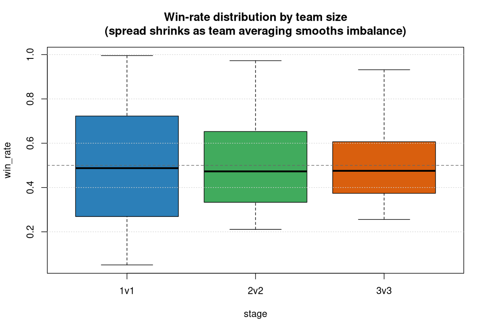
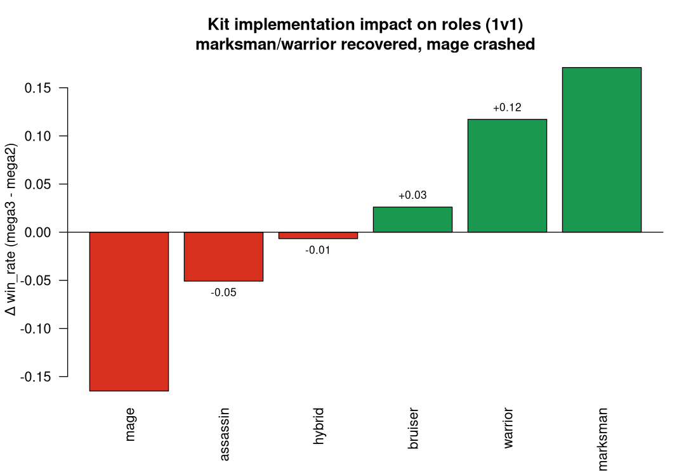
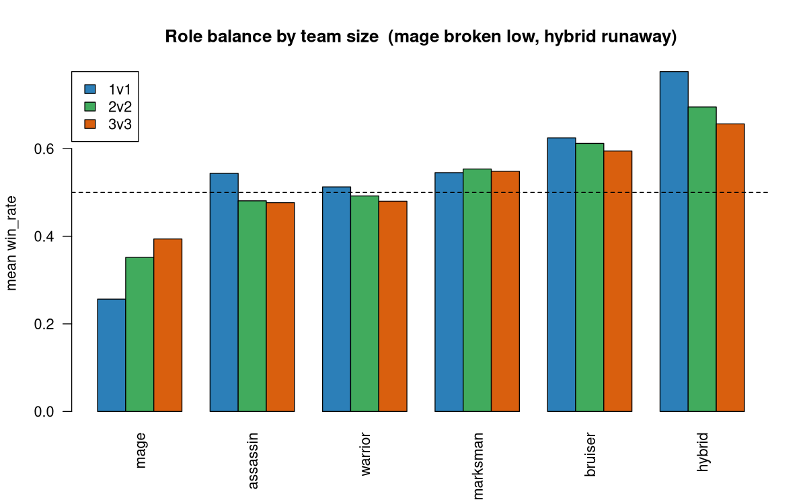
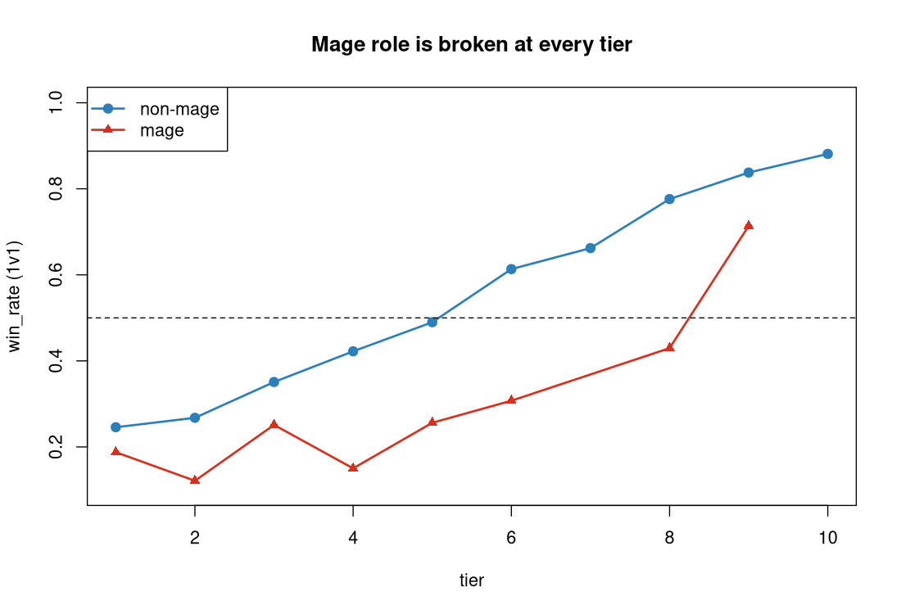
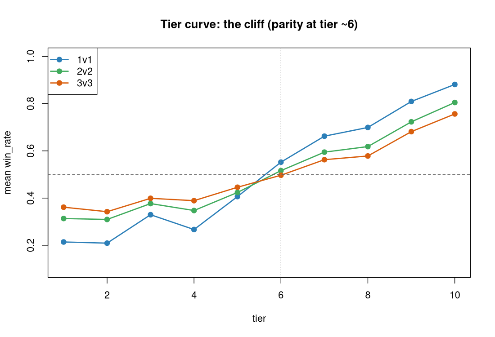
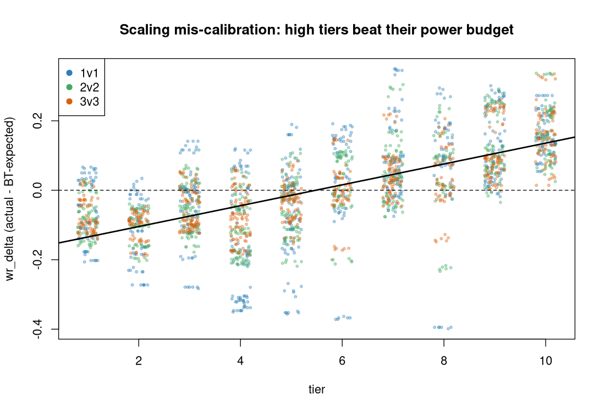
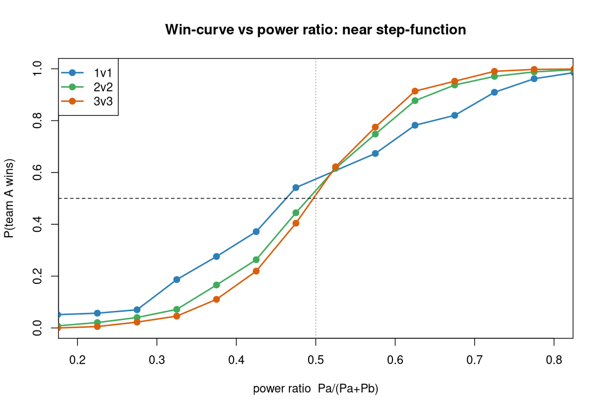
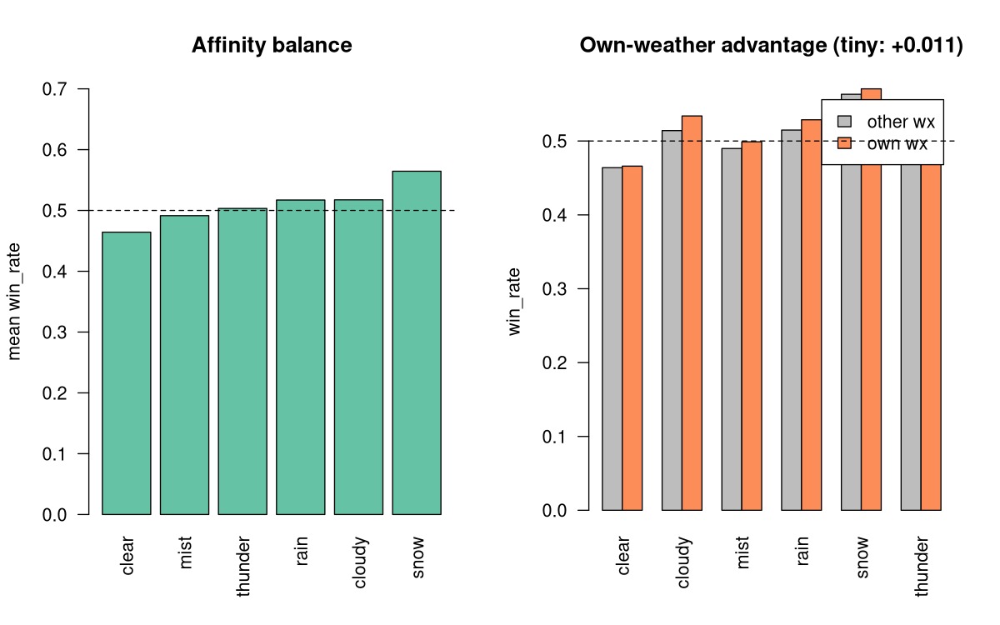
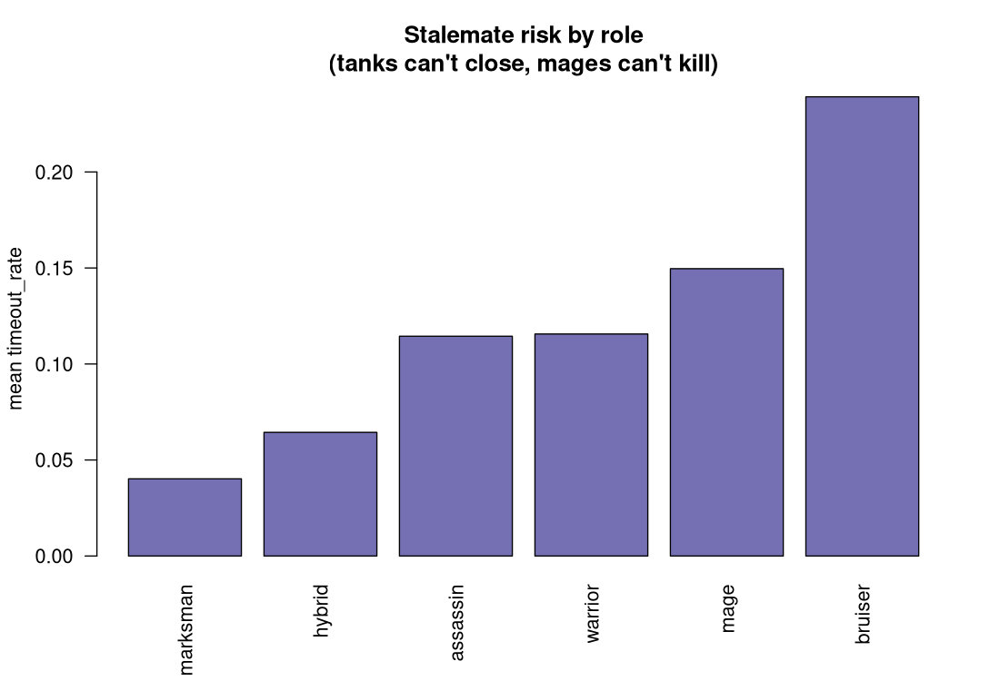
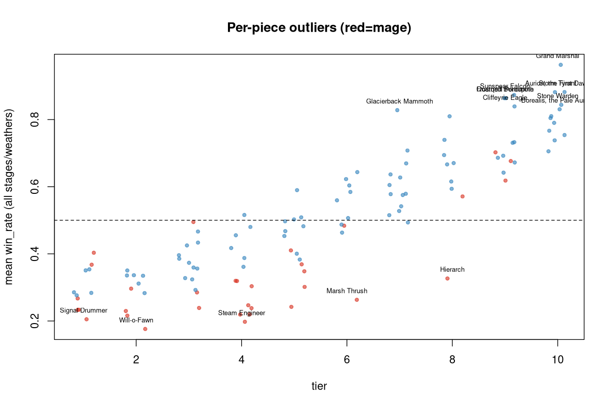

# Mega3 Simulation Analysis Report

*Deep statistical analysis of the `results/mega3/` sweep — the first mega run with the T.30 ability catalog wired in. Successor to [`reviews/mega2_analysis_report.md`](mega2_analysis_report.md).*

Generated 2026-06-01 from `results/mega3/` via R 4.5.3. All figures, tables, and scripts are reproducible — see [§14](#14-reproducibility).

---

## 0. Executive summary

**This is the first dataset where designed ability kits actually fire.** Mega2 ran on a build where 0/240 roster ability-ids resolved to a handler, so every piece fell back to an INT-scaled generic nuke. Mega3 inherits the T.30 catalog. The headline is the *consequence of that fix*:

> **Implementing kits flipped the role hierarchy.** The INT-nuke artifact that propped mages up and crippled STR pieces is gone — but the pendulum overshot. **Marksman (+0.17) and warrior (+0.12) recovered exactly as mega2 predicted; mage collapsed (−0.17) into the single broken role.**

Four findings carry the report:

1. **Aggregate balance is still healthy.** Champion-vs-enemy win rate is centered on 0.50 in every format (§2). The faction math is sound; the problems are *within-roster*.
2. **Mage is broken at every tier** — a ~0.20 win-rate deficit vs non-mages *after controlling for tier*, in both champion and enemy factions (§4–5). Not a faction or a content bug — a role-design failure.
3. **The tier cliff survived the kit rewrite, and scaling is mis-calibrated.** Parity sits at tier ~6; tiers 1–5 are all net losers. High tiers *beat their own power budget* (`cor(tier, wr_delta) = 0.55→0.74`), so the BT/power model under-rewards low tiers and over-rewards high ones (§6).
4. **Weather is nearly inert.** Own-weather affinity is worth only **+0.011** win rate; the strongest piece posts an *identical* 0.9958 across clear/cloudy/mist/rain. The core thematic mechanic barely touches outcomes (§8).

Plus two sharp piece outliers: **Grand Marshal** (clear warrior T10) is effectively unloseable at 0.9958 in 1v1; **Will-o-Fawn** (mist mage T2) is near-unwinnable at 0.0504.

---

## 1. Dataset and method

| Stage | Weathers | Battles / weather | Pieces | Rated rows |
|---|---|---|---|---|
| 1v1 (round-robin) | 6 | 7,140 | 120 | 720 |
| team2-sample (2v2) | 6 | 26,000 | 120 | 720 |
| team3-sample (3v3) | 6 | 16,000 | 120 | 720 |

- **294,840 battles** total across 18 `results_*.csv`; **2,160 rated rows** (120 pieces × 3 stages × 6 weathers) across 18 `ratings_*.csv`.
- 120 pieces = 60 champions + 60 enemies. Affinity split is unbalanced by design: **clear 40, all others 16** (clear is the neutral default).
- **`--max-ticks 12000`** this run (vs mega2's effectively-infinite 1e6) → **timeouts now exist** (~11–13% of fights). Every timeout is recorded as a `draw` (verified: `draw == timed_out` to the row in all stages). This is the main reason duration/timeout metrics are *not* comparable to mega2.
- **Metrics:** `win_rate`; `expected_wr` (Bradley-Terry budget from `power(T,L)`); `wr_delta = win_rate − expected_wr`; `beta` (BT strength); `timeout_rate`; `mean_duration_ticks`.
- **Power proxy** for the win-curve: team `ΣP` via `power(tier, 1)` mirroring [src/game/scaling.py](../../src/game/scaling.py#L1). Per-battle level isn't logged, so this is a level-1 proxy — adds scatter, preserves monotone shape.

---

## 2. Aggregate balance is healthy

Champion vs enemy mean win rate, symmetric and centered everywhere:

| stage | champion | enemy |
|---|---|---|
| 1v1 | 0.516 | 0.484 |
| 2v2 | 0.508 | 0.494 |
| 3v3 | 0.500 | 0.501 |

The ~1.6pp champion edge in 1v1 dissolves with team size. Faction-level balance is **not** a problem. Every issue below lives *inside* the roster.



The distribution **tightens dramatically with team size** — `sd(wr_delta)` falls 0.160 (1v1) → 0.124 (2v2) → 0.106 (3v3). Team averaging launders individual imbalance: a broken piece on a 3-stack is diluted by two teammates. This is structural and matches mega2.

---

## 3. The kit-implementation flip (mega2 → mega3)

Mega2's rectification note warned that the role verdicts were artifacts of the INT-scaled fallback nuke (`raw = 0.2·STR + 4.2·INT`, INT 21× STR). Mega3 confirms the warning **and** the predicted direction of correction:



| role | mega2 (1v1) | mega3 (1v1) | Δ |
|---|---|---|---|
| **marksman** | 0.374 | 0.545 | **+0.171** |
| **warrior** | 0.395 | 0.513 | **+0.117** |
| bruiser | 0.598 | 0.625 | +0.026 |
| hybrid | 0.782 | 0.776 | −0.007 |
| assassin | 0.594 | 0.544 | −0.051 |
| **mage** | 0.421 | 0.256 | **−0.165** |

STR/AD pieces (marksman, warrior) — "crippled by the INT fallback, not mis-designed" per mega2 — **recovered to ~parity** the moment their real kits fired. But mage, which the fallback had been silently carrying, **fell off a cliff** once it had to rely on its actual kit. The fix was correct; the mage kit catalog is the new gap.

---

## 4. Role balance — mage crisis, hybrid runaway



Overall mean win rate (all stages × weathers):

| role | win_rate | wr_delta |
|---|---|---|
| **mage** | **0.334** | **−0.122** |
| warrior | 0.495 | +0.025 |
| assassin | 0.500 | −0.008 |
| marksman | 0.549 | +0.064 |
| bruiser | 0.610 | +0.080 |
| **hybrid** | **0.709** | **+0.091** |

Two ends need attention:

- **Mage (0.33)** — the only role decisively below parity, by a wide margin. Detailed in §5.
- **Hybrid (0.71)** — runaway top, *and stable across team sizes* (0.776/0.695/0.656). Hybrids carry both stat lines, so they neither starve for damage (mage's problem) nor lack survivability (warrior's). Worth a power audit; less urgent than mage because it doesn't produce 5% win-rate pieces.

bruiser/marksman sit comfortably above parity; warrior/assassin straddle it. The healthy core is the warrior–assassin–marksman band; the tails (mage low, hybrid high) are the design debt.

---

## 5. Mage deep-dive — the diagnosis



The mage line tracks ~0.15–0.25 *below* non-mages at **every** tier. A tier-9 mage barely reaches parity; the roster has no tier-10 mage to test the ceiling.

Controls that rule out the easy explanations:

- **Not a faction bug.** Mage champions (0.355) and mage enemies (0.309) are *both* broken. It is the role, not one content author.
- **Not a tier artifact.** Mean within-tier deficit vs non-mages (1v1) = **0.198**. Even matched on tier, a mage loses ~20pp it shouldn't.
- **Mechanism = no burst, no bulk.** Mages have the lowest HP and now lack the free INT nuke that the fallback gave everyone. Their fights run *longer* than average (7157 vs 6954 ticks in 1v1) and they still lose — they neither kill fast nor survive. timeout_rate (0.15) is mid-pack: they don't stall to a draw, they get ground out.

**This is the report's top action item.** The mage kit catalog either deals too little damage, fires too slowly, or both. Re-tune mage abilities (burst windows / cast cadence / base HP) and re-sim before any other balance pass.

---

## 6. The tier cliff and scaling mis-calibration



The cliff that dominated mega2 **survived the kit rewrite intact**. `cor(tier, win_rate) ≈ 0.87` in all three stages. Parity crosses at **tier ~6**: tiers 1–5 are net losers, 7–10 net winners. The low-tier floor is brutal — tier-1/2 pieces win ~21% in 1v1.

The subtler problem is in `wr_delta`:



`wr_delta` (actual − BT-expected) **rises monotonically with tier**: `cor(tier, wr_delta)` = 0.55 (1v1) → 0.70 (2v2) → **0.74 (3v3)**. High tiers systematically *beat their own power budget* while low tiers fall short of theirs. That means the `power(T,L)` curve **under-states the real marginal value of a tier** — the BT model thinks a T10 should win X%, and it wins X+15%. The scaling exponent (or the stat→outcome transfer) is too shallow at the top / too generous at the bottom. Re-fitting `power()` so `wr_delta` is tier-flat would compress the cliff without touching any kit.

---

## 7. Decisiveness and the win-curve



Combat is still a **near step-function** of power ratio — the contested band (where P(win) ∈ [0.2, 0.8]) is roughly `Pa/(Pa+Pb) ∈ [0.35, 0.65]`. Two refinements over mega2:

- **3v3 is the steepest** (most decisive at parity), 1v1 the flattest. More bodies → more reliable focus-fire → less variance → sharper curve. Consistent with the `sd(wr_delta)` shrink in §2.
- **1v1 carries a side-A bias.** The 1v1 curve crosses 0.5 *left* of parity; at `|pr−0.5|<0.025`, side A wins **0.542** in 1v1 vs ~0.51 in 2v2/3v3. A ~4pp initiative/turn-order advantage in duels. Worth checking the 1v1 tie-break / who-acts-first logic.

Winner HP-remaining (stomp proxy) scales with team size — 799 (1v1) / 1406 (2v2) / 1937 (3v3) — i.e. larger fights end with more leftover HP on the winning side: snowball/focus-fire leaves survivors at high HP.

**Balance scorecard** (fraction of piece×stage×weather cells near parity):

| stage | in [.45,.55] | blowout <.3 | blowout >.7 |
|---|---|---|---|
| 1v1 | 0.11 | 0.28 | 0.28 |
| 2v2 | 0.17 | 0.14 | 0.18 |
| 3v3 | 0.25 | 0.04 | 0.12 |

1v1 is **highly polarized** — only 11% of matchups are competitive, 56% are blowouts. This is the cliff (§6) plus the role tails (§4) compounding. It tightens at 3v3 but never gets *good*.

---

## 8. Weather is nearly inert

The signature mechanic — real-world weather shaping combat — barely registers.



- **Own-weather advantage = +0.011 win rate.** A piece fighting in its own affinity-weather wins 0.509 vs 0.499 otherwise. Largest sub-effect is thunder (+0.024); clear is ~0.
- **Mean per-piece win-rate range across all 6 weathers = 0.027** (median 0.022). The *most* weather-sensitive piece (Aerion) swings only 0.090.
- **Smoking gun:** Grand Marshal posts an *identical* 0.9958 in clear, cloudy, mist, and rain (§11). Will-o-Fawn posts an identical 0.0504 across mist/rain/snow/thunder. Outcomes are weather-invariant to 4 decimals for the pieces where it would matter most.

Either the weather stat-packs / affinity damage-triangle apply tiny coefficients, or kits don't read weather state. For a game whose pitch is "live weather shapes combat," a ±1pp effect is a thematic failure. **Recommend a dedicated weather-sensitivity audit** before shipping — this is a top-3 issue even though it isn't a *balance* issue.

---

## 9. Affinity balance

| affinity | win_rate | wr_delta | n pieces |
|---|---|---|---|
| clear | 0.464 | −0.016 | 40 |
| mist | 0.491 | −0.018 | 16 |
| thunder | 0.503 | −0.007 | 16 |
| rain | 0.517 | +0.007 | 16 |
| cloudy | 0.517 | +0.007 | 16 |
| snow | 0.564 | +0.055 | 16 |

Spread is modest (0.46–0.56). **Snow runs hot** (+0.055) and **clear runs cool** (−0.016). Clear's softness partly reflects it being the catch-all bucket (40 pieces incl. the mage-heavy low tiers). Snow is worth a glance but is second-order next to mage/tier/weather.

---

## 10. Stalemates and timeouts

With `--max-ticks 12000`, ~11–13% of fights now time out (→ draw). Distribution by role:

| role | timeout_rate |
|---|---|
| bruiser | 0.239 |
| mage | 0.150 |
| warrior | 0.116 |
| assassin | 0.114 |
| hybrid | 0.064 |
| marksman | 0.040 |



Two distinct stall modes: **tanks that can't close** (bruiser/warrior — high HP, low burst → mutual attrition) and **mages that can't kill** (low damage). Marksman/hybrid resolve cleanly. The worst single piece is **Coral Colossus** (warrior T5, 46% timeouts, mean 10,063 ticks) — a damage-starved wall. Bruiser timeouts are the strongest argument for keeping a finite max-ticks + sudden-death rule rather than mega2's 1e6.

---

## 11. Outlier roster

**Strongest (mean win_rate, all stages/weathers):**

| name | affinity | role | tier | win_rate | wr_delta |
|---|---|---|---|---|---|
| **Grand Marshal** | clear | warrior | 10 | **0.963** | **+0.311** |
| Storm Tyrant | thunder | hybrid | 10 | 0.882 | +0.228 |
| Aurion, the First Dawn | clear | hybrid | 10 | 0.882 | +0.228 |
| Sunspear Falcon | clear | marksman | 9 | 0.873 | +0.258 |
| Quarried Behemoth | cloudy | bruiser | 9 | 0.864 | +0.248 |
| Glacierback Mammoth | snow | bruiser | 7 | 0.828 | **+0.282** |

**Weakest — every one is a mage:**

| name | affinity | role | tier | win_rate | wr_delta |
|---|---|---|---|---|---|
| **Will-o-Fawn** | mist | mage | 2 | **0.176** | −0.218 |
| Steam Engineer | clear | mage | 4 | 0.198 | −0.247 |
| Signal Drummer | clear | mage | 1 | 0.205 | −0.162 |
| Dusk Bat | cloudy | mage | 2 | 0.216 | −0.179 |
| Coppercrest Stork | thunder | mage | 4 | 0.219 | −0.228 |
| Drowned Siren | rain | mage | 4 | 0.220 | −0.230 |

Specific flags:

- **Grand Marshal** — `wr_delta` rises with team size (+0.27 / +0.33 / +0.33) and hits **0.9958 in 1v1, weather-invariant**. Effectively unloseable in a duel; overtuned T10 warrior kit. Top single-piece nerf target.
- **Glacierback Mammoth** (T7) — biggest overperformer by `wr_delta` (+0.282) at a *non-max* tier. Punches two tiers above weight; flag the kit.
- **Hierarch** (clear mage T8) — *worst* `wr_delta` at −0.253: a high-tier piece with a high power budget that still loses. Mage problem at its most expensive.
- **Will-o-Fawn** — 0.0504 floor, weather-invariant. The bottom of the mage crisis.



---

## 12. Prioritized recommendations

| # | Action | Why | Effort |
|---|---|---|---|
| **1** | **Re-tune the mage kit catalog** (burst, cast cadence, base HP) | Mage is the one broken role: −0.20 within-tier, both factions, every weakest piece (§5) | High |
| **2** | **Audit weather coefficients / confirm kits read weather** | Own-weather worth +0.011; outcomes weather-invariant to 4dp — the core mechanic is inert (§8) | Med |
| **3** | **Re-fit `power(T,L)`** so `wr_delta` is tier-flat | High tiers beat their budget (`cor=0.74`); fixes the cliff without touching kits (§6) | Med |
| **4** | **Nerf Grand Marshal; review Glacierback Mammoth & Hierarch** | Discrete, identifiable piece outliers (§11) | Low |
| **5** | **Audit hybrid power** | Runaway top role at 0.71, stable across stages (§4) | Med |
| **6** | **Investigate 1v1 side-A bias (~4pp at parity)** | Initiative/turn-order edge in duels (§7) | Low |
| **7** | **Keep finite max-ticks + add sudden-death** | Bruiser/warrior stalls hit 24% timeout; mega2's 1e6 hid this (§10) | Low |

Sequence: do **#1** then re-sim (mega4 is already generating). Don't trust hybrid/affinity verdicts until mage is fixed — a broken role drags every opponent's win rate and distorts the field.

---

## 13. What's trustworthy vs provisional

- **Solid (structural):** aggregate faction balance, the cliff, team-size variance shrink, the win-curve shape, the mage collapse (controlled for tier *and* faction), the kit-flip direction.
- **Provisional:** absolute role/affinity numbers shift once the mage kit is fixed (mage opponents' win rates are inflated by farming mages). The `power()` re-fit (#3) interacts with kit re-tunes — do them in that order and re-measure.
- **Caveat:** weather samples are sane but the +0.011 effect is small enough that any per-affinity number is within noise; treat §9 as directional.

---

## 14. Reproducibility

All scripts in [`reviews/mega_sim/`](.), base R only (no external packages):

| script | output |
|---|---|
| `00_load.R` | loader helpers (`power`, `load_ratings`, `load_results`, `team_power`) |
| `01_analysis.R` | core stats → `tables/*.csv`, `cache.rds` |
| `02_results.R` | per-battle win-curve + mega2 comparison → `cache_results.rds` |
| `03_plots.R` | 10 PNGs → `plots/` |

```bash
cd /home/merlindk/development/tempest-fauna-trail
Rscript reviews/mega_sim/01_analysis.R
Rscript reviews/mega_sim/02_results.R
Rscript reviews/mega_sim/03_plots.R
```

Tables: `tables/{role_balance,affinity_balance,tier_curve,weather_sensitivity,piece_overall,wincurve,mega2_vs_mega3_role}.csv`.
