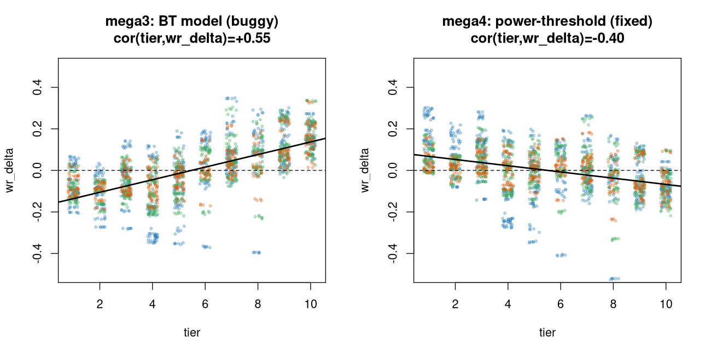
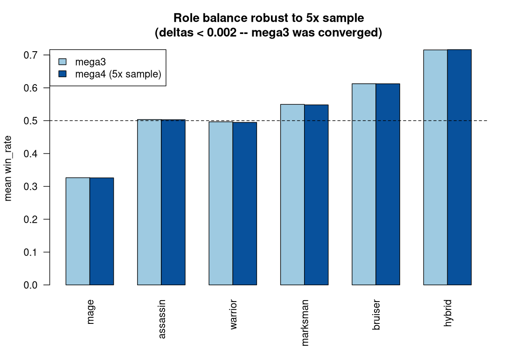
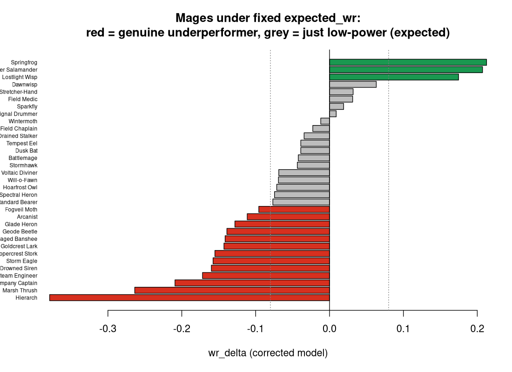

# Mega3 + Mega4 Simulation Analysis Report

*Deep statistical analysis of the `results/mega3/` sweep (first mega run with the T.30 ability catalog wired in) plus the `results/mega4/` re-run (corrected `expected_wr` model + 5× sample). Successor to [`reviews/mega2_analysis_report.md`](mega2_analysis_report.md).*

Generated 2026-06-01, mega4 integrated 2026-06-02, via R 4.5.3. All figures, tables, and scripts are reproducible — see [§14](#14-reproducibility).

> **Read [§0.5](#05-mega4-integration--the-expected_wr-fix) first.** Mega4 fixed a bug in `expected_wr`. Combat is unchanged, so **every `win_rate` finding below holds** (confirmed at 5× sample). But **every `wr_delta` figure carried in §2, §4, §6, §9, §11 was computed on the buggy mega3 metric** — the corrected (mega4) values are in §0.5, §4, and §9. The buggy values can even change sign (role `wr_delta`), so trust only the explicitly-labelled *corrected* numbers.

---

## 0. Executive summary

**This is the first dataset where designed ability kits actually fire.** Mega2 ran on a build where 0/240 roster ability-ids resolved to a handler, so every piece fell back to an INT-scaled generic nuke. Mega3 inherits the T.30 catalog. The headline is the *consequence of that fix*:

> **Implementing kits flipped the role hierarchy.** The INT-nuke artifact that propped mages up and crippled STR pieces is gone — but the pendulum overshot. **Marksman (+0.17) and warrior (+0.12) recovered exactly as mega2 predicted; mage collapsed (−0.17) to the lowest win rate.** (Caveat that the whole report turns on: *raw role win rate is confounded by tier* — see §4. Once you control for tier / read the corrected `wr_delta`, the genuinely **over-tuned** roles are marksman & warrior, and both mage **and hybrid** *under*-deliver vs their power target.)

Four findings carry the report:

1. **Aggregate balance is still healthy.** Champion-vs-enemy win rate is centered on 0.50 in every format (§2). The faction math is sound; the problems are *within-roster*.
2. **Mage is broken at every tier** — a ~0.20 win-rate deficit vs non-mages *after controlling for tier*, in both champion and enemy factions (§4–5). Not a faction or a content bug — a role-design failure.
3. **The tier cliff survived the kit rewrite.** Parity sits at tier ~6; tiers 1–5 are all net losers; `cor(tier, win_rate) = 0.87` (§6). *(The original "high tiers beat their power budget" claim rested on a buggy `expected_wr` — corrected in [§0.5](#05-mega4-integration--the-expected_wr-fix).)*
4. **Weather is nearly inert.** Own-weather affinity is worth only **+0.011** win rate; the strongest piece posts an *identical* 0.9958 across clear/cloudy/mist/rain. The core thematic mechanic barely touches outcomes (§8).

Plus two sharp piece outliers: **Grand Marshal** (clear warrior T10) is effectively unloseable at 0.9958 in 1v1; **Will-o-Fawn** (mist mage T2) is near-unwinnable at 0.0504.

---

## 0.5 Mega4 integration & the `expected_wr` fix

*Added 2026-06-02.* A second sweep, `results/mega4/`, was run after this report's first draft. It changes **two** things and nothing else:

1. **`expected_wr` bug fixed.** Mega3 derived `expected_wr` from a Bradley-Terry beta model; mega4 replaces it with a **deterministic power-threshold model** ([tools/simulation/ratings.py:85-95](../../tools/simulation/ratings.py#L85-L95)): for each matchup, expected = 1.0 if your team's total `power(T,L)` exceeds the opponent's, 0.0 if less, 0.5 if equal — averaged over the *actual* opponent field. So `wr_delta = win_rate − expected_wr` now reads cleanly as **"do you beat the opponents you outpower?"**
2. **5× sample.** team2 `n=130k` (was 26k), team3 `n=78k` (was 16k). 1v1 stays full round-robin.

**The combat engine did not change.** Per-piece `win_rate` is identical between runs (Aegis Tortoise = 0.4034 in both; median per-piece 1v1 shift = **0.0000**). Therefore:

- ✅ **Every `win_rate`-based finding (§2, §3, §4, §5, §7, §8, §9, §10) holds — and is now confirmed at 5× sample.** Role means move <0.002 mega3→mega4; the mage within-tier deficit is **0.198 in both**; own-weather advantage is +0.008 in both. Mega3 was already converged.
- ❌ **The `wr_delta` interpretation in the original §6 and §11 was computed on the buggy metric. It is corrected here and those sections are annotated.**

> ⚠️ Mega4 is **still running** as of 2026-06-02 07:20 — `results/mega4/` has 1v1 ×6 and team2 ×6 complete, but **team3 only has clear/cloudy/mist/rain (4/6 — snow + thunder pending, ETA ~2h).** All `wr_delta` figures below use complete cells only; team3 numbers will firm up when the run finishes. A stale background `mega3` job (small-`n`) is also alive and contending CPU — worth killing to speed mega4 (see closing note).

**Corrected calibration finding (replaces old §6 claim #3):**



**What `wr_delta` actually measures.** Power `P` is a **fixed design target** assigned to each piece — it does not move. Pieces are tuned (active/passive abilities + stat fine-tuning) so that each one's *realized* combat strength matches its assigned `P`. The corrected `expected_wr` is the win rate a piece *should* post if it exactly hit its `P` target against the field it faced. Therefore:

> **`wr_delta` is the per-piece tuning residual.** `wr_delta ≈ 0` → the piece is tuned on-target. `wr_delta < 0` → **under-tuned** (its kit delivers less than its `P` promises). `wr_delta > 0` → **over-tuned** (kit over-delivers vs `P`). The tuning goal is to drive every piece's `wr_delta` toward 0 — *not* to change `P`.

The buggy BT model produced `cor(tier, wr_delta) = +0.55→+0.74`. Under the fixed power-threshold model the correlation **flips to −0.40** (stable across all three stages) and the spread tightens (`sd(wr_delta)` 0.160→0.147 in 1v1, 0.107→0.074 in 3v3). The corrected reading:

- **There is a mild systematic under-tuning at high tiers.** The negative slope says high-`P` pieces realize *slightly less* than their target (their bigger kits don't fully cash in) while low-`P` pieces slightly over-deliver. It's a small residual, not an emergency — but it points tuning effort toward the top of the roster.
- **`power()` does not need re-fitting.** `P` is the fixed yardstick by design; the earlier "re-fit `power()`" idea was backwards. The lever is each piece's abilities/stats, measured *against* `P`.
- **The tier `win_rate` cliff is intended, not a bug** (`cor(tier, win_rate) = 0.87`): a high-`P` piece *should* beat a low-`P` one. §6's cliff is by-design decisiveness; only its old `wr_delta` gloss was wrong.

**Corrected outlier reading (refines §11):** with a trustworthy `wr_delta`, the weak-mage list splits into two kinds —

| Genuine underperformers (lose vs equal/weaker power) | "Low but on budget" (just low-tier) |
|---|---|
| Hierarch T8 (−0.379), Marsh Thrush T6 (−0.264), Company Captain T5 (−0.209), Storm Eagle T9 (−0.158), Arcanist T9 (−0.111), Glade Heron T8 (−0.128) | Will-o-Fawn T2 (−0.069), Signal Drummer T1 (+0.009), Sparkfly T1 (+0.019), Dusk Bat T2 (−0.039) |

In tuning-target terms: the red column = mages whose kits are **under-tuned vs their assigned `P`** (they have the target strength to win and don't); the grey = mages that are **on-target** and simply low-`P`. This **sharpens the mage verdict (§5):** the tuning work is concentrated in **mid/high-tier mages** (Hierarch T8 −0.38, Marsh Thrush T6 −0.26, Company Captain T5 −0.21, Storm Eagle/Arcanist T9) — buff their abilities until `wr_delta → 0`. The tier-1/2 mages (incl. Will-o-Fawn, the headline "0.05" piece) are mostly on-target — their low win rate is their low `P`, not a tuning fault. **Mage fix priority = T6+ casters (Hierarch first), not the T1 floor.**




Also note **Grand Marshal**: his `wr_delta` drops from +0.31 (buggy) to **+0.07** (fixed) — the threshold model correctly *expects* a T10 to win ~0.96, so he's no longer a model-flagged overperformer. He is still a raw outlier (0.97 win, near-unloseable) and still worth a nerf; he's just winning about what his power says he should.

---

## 1. Dataset and method

| Stage | Weathers | Battles / weather | Pieces | Rated rows |
|---|---|---|---|---|
| 1v1 (round-robin) | 6 | 7,140 | 120 | 720 |
| team2-sample (2v2) | 6 | 26,000 | 120 | 720 |
| team3-sample (3v3) | 6 | 16,000 | 120 | 720 |

- **294,840 battles** total across 18 `results_*.csv`; **2,160 rated rows** (120 pieces × 3 stages × 6 weathers) across 18 `ratings_*.csv`. (Mega4 re-runs the same design at ~5× sample — team2 130k/wx, team3 78k/wx — see §0.5.)
- 120 pieces = 60 champions + 60 enemies. Affinity split is unbalanced by design: **clear 40, all others 16** (clear is the neutral default).
- **`--max-ticks 12000`** this run (vs mega2's effectively-infinite 1e6) → **timeouts now exist** (~11–13% of fights). Every timeout is recorded as a `draw` (verified: `draw == timed_out` to the row in all stages). This is the main reason duration/timeout metrics are *not* comparable to mega2.
- **Metrics:** `win_rate`; `expected_wr`; `wr_delta = win_rate − expected_wr`; `timeout_rate`; `mean_duration_ticks`. **`expected_wr` differs by run:** mega3 used a Bradley-Terry budget (since shown buggy — it also emitted `beta`/`beta_ratio`/`beta_deviation_pct`); **mega4 uses the corrected deterministic power-threshold model** (§0.5). Read `wr_delta` only from mega4.
- **Power proxy** for the win-curve: team `ΣP` via `power(tier, 1)` mirroring [src/game/scaling.py](../../src/game/scaling.py#L1). Per-battle level isn't logged, so this is a level-1 proxy — adds scatter, preserves monotone shape.

---

## 2. Aggregate balance is healthy

Champion vs enemy mean win rate, symmetric and centered everywhere:

| stage | champion | enemy |
|---|---|---|
| 1v1 | 0.516 | 0.484 |
| 2v2 | 0.508 | 0.494 |
| 3v3 | 0.500 | 0.501 |

The ~1.6pp champion edge in 1v1 dissolves with team size. Faction-level balance is **not** a problem. Every issue below lives *inside* the roster.


The distribution **tightens dramatically with team size** — `sd(win_rate)` falls 0.267 (1v1) → 0.187 (2v2) → 0.149 (3v3). (Model-independent, so unaffected by the `expected_wr` fix.) Team averaging launders individual imbalance: a broken piece on a 3-stack is diluted by two teammates. This is structural and matches mega2.

---

## 3. The kit-implementation flip (mega2 → mega3)

Mega2's rectification note warned that the role verdicts were artifacts of the INT-scaled fallback nuke (`raw = 0.2·STR + 4.2·INT`, INT 21× STR). Mega3 confirms the warning **and** the predicted direction of correction:


| role | mega2 (1v1) | mega3 (1v1) | Δ |
|---|---|---|---|
| **marksman** | 0.374 | 0.545 | **+0.171** |
| **warrior** | 0.395 | 0.513 | **+0.117** |
| bruiser | 0.598 | 0.625 | +0.026 |
| hybrid | 0.782 | 0.776 | −0.007 |
| assassin | 0.594 | 0.544 | −0.051 |
| **mage** | 0.421 | 0.256 | **−0.165** |

STR/AD pieces (marksman, warrior) — "crippled by the INT fallback, not mis-designed" per mega2 — **recovered to ~parity** the moment their real kits fired. But mage, which the fallback had been silently carrying, **fell off a cliff** once it had to rely on its actual kit. The fix was correct; the mage kit catalog is the new gap.

---

## 4. Role balance — tier-confounded; mage & hybrid under-deliver, marksman/warrior over-deliver


> ⚠️ **Read raw role `win_rate` with care — it is confounded by tier.** Roles are not evenly spread across tiers: mage mean tier **4.1**, hybrid mean tier **9.1** (median 10). So "mage lowest / hybrid highest win_rate" largely restates "mage pieces are low-tier, hybrid pieces are high-tier." The honest role signal is the **corrected `wr_delta`** (delivery vs the `P` target, §0.5) and the **within-tier** comparison below.

Overall mean win rate (raw) and **corrected (mega4) `wr_delta`** by role:

| role | win_rate | mean tier | `wr_delta` (corrected) | reading |
|---|---|---|---|---|
| **mage** | 0.334 | 4.1 | **−0.064** | low win = low tier; under-delivers, worst at high tier (§5) |
| assassin | 0.500 | 5.9 | −0.014 | on-target |
| warrior | 0.495 | 4.5 | **+0.072** | **over-target** (wins more than `P` warrants) |
| marksman | 0.549 | 5.0 | **+0.087** | **most over-target** |
| bruiser | 0.610 | 6.5 | +0.041 | mildly over-target |
| **hybrid** | **0.709** | **9.1** | **−0.082** | **most *under*-target — high win_rate is pure tier** |

The corrected `wr_delta` ranking is **nearly the reverse** of the raw-win_rate ranking. Two reframes follow:

- **Hybrid is *not* a runaway over-powered role.** Its 0.71 win_rate is a roster-composition artifact: hybrids are almost all tier 9–10. **Within tier, hybrids win 6–9pp *less* than non-hybrids at the same tier** (Δ = −0.057 to −0.091; mean −0.082) — they *under*-deliver their `P`, the same direction as mage. No nerf is warranted; if anything hybrid kits are slightly under-tuned. *(The earlier "hybrid runaway / design debt" read was an un-tier-controlled error.)*
- **The genuinely over-target roles are marksman (+0.087) and warrior (+0.072)** — they win more than their (lower) `P` says they should. If any role is "too strong for its power," it's these two, not hybrid.

So the under-delivering roles (buff candidates) are **mage and hybrid**; the over-delivering roles (trim candidates) are **marksman and warrior**; assassin/bruiser are close to on-target. Mage stays the priority because its under-delivery concentrates in expensive high-tier casters (§5) and it also owns the raw-win_rate floor.

---

## 5. Mage deep-dive — the diagnosis


The mage line tracks ~0.15–0.25 *below* non-mages at **every** tier. A tier-9 mage barely reaches parity; the roster has no tier-10 mage to test the ceiling.

Controls that rule out the easy explanations:

- **Not a faction bug.** Mage champions (0.355) and mage enemies (0.309) are *both* broken. It is the role, not one content author.
- **Not a tier artifact.** Mean within-tier deficit vs non-mages (1v1) = **0.198**. Even matched on tier, a mage loses ~20pp it shouldn't.
- **Mechanism = no burst, no bulk.** Mages have the lowest HP and now lack the free INT nuke that the fallback gave everyone. Their fights run *longer* than average (7157 vs 6954 ticks in 1v1) and they still lose — they neither kill fast nor survive. timeout_rate (0.15) is mid-pack: they don't stall to a draw, they get ground out.

**This is the report's top action item.** The mage kit catalog either deals too little damage, fires too slowly, or both. Re-tune mage abilities (burst windows / cast cadence / base HP) and re-sim before any other balance pass.

---

## 6. The tier cliff


The cliff that dominated mega2 **survived the kit rewrite intact**. `cor(tier, win_rate) ≈ 0.87` in all three stages. Parity crosses at **tier ~6**: tiers 1–5 are net losers, 7–10 net winners. The low-tier floor is brutal — tier-1/2 pieces win ~21% in 1v1. This is an observed-outcome fact, independent of any rating model, and it is **confirmed unchanged at mega4's 5× sample.**

> ⚠️ **Corrected — see [§0.5](#05-mega4-integration--the-expected_wr-fix).** This section originally argued from `wr_delta` that "high tiers beat their power budget" (`cor(tier, wr_delta) = +0.55→+0.74`) and that `power()` under-rewards low tiers. **That rested on a buggy `expected_wr`.** Under mega4's fixed power-threshold model the correlation flips to **−0.40** and the spread tightens — there is *no* systematic under-reward of low tiers. The `power()` curve does **not** need re-fitting. The cliff is about HP/DPS/focus-fire decisiveness (§7), not a scaling-math error. The plot below (`06_wrdelta_vs_tier.png`, buggy metric) is retained only for the before/after in §0.5.

---

## 7. Decisiveness and the win-curve


Combat is still a **near step-function** of power ratio — the contested band (where P(win) ∈ [0.2, 0.8]) is roughly `Pa/(Pa+Pb) ∈ [0.35, 0.65]`. Two refinements over mega2:

- **3v3 is the steepest** (most decisive at parity), 1v1 the flattest. More bodies → more reliable focus-fire → less variance → sharper curve. Consistent with the `sd(win_rate)` shrink in §2.
- **1v1 carries a side-A bias.** The 1v1 curve crosses 0.5 *left* of parity; at `|pr−0.5|<0.025`, side A wins **0.542** in 1v1 vs ~0.51 in 2v2/3v3. A ~4pp initiative/turn-order advantage in duels. Worth checking the 1v1 tie-break / who-acts-first logic.

Winner HP-remaining (stomp proxy) scales with team size — 799 (1v1) / 1406 (2v2) / 1937 (3v3) — i.e. larger fights end with more leftover HP on the winning side: snowball/focus-fire leaves survivors at high HP.

**Balance scorecard** (fraction of piece×stage×weather cells near parity):

| stage | in [.45,.55] | blowout <.3 | blowout >.7 |
|---|---|---|---|
| 1v1 | 0.11 | 0.28 | 0.28 |
| 2v2 | 0.17 | 0.14 | 0.18 |
| 3v3 | 0.25 | 0.04 | 0.12 |

1v1 is **highly polarized** — only 11% of matchups are competitive, 56% are blowouts. This is the cliff (§6) plus the role tails (§4) compounding. It tightens at 3v3 but never gets *good*.

---

## 8. Weather is nearly inert

The signature mechanic — real-world weather shaping combat — barely registers.


- **Own-weather advantage = +0.011 win rate.** A piece fighting in its own affinity-weather wins 0.509 vs 0.499 otherwise. Largest sub-effect is thunder (+0.024); clear is ~0.
- **Mean per-piece win-rate range across all 6 weathers = 0.027** (median 0.022). The *most* weather-sensitive piece (Aerion) swings only 0.090.
- **Smoking gun:** Grand Marshal posts an *identical* 0.9958 in clear, cloudy, mist, and rain (§11). Will-o-Fawn posts an identical 0.0504 across mist/rain/snow/thunder. Outcomes are weather-invariant to 4 decimals for the pieces where it would matter most.

Either the weather stat-packs / affinity damage-triangle apply tiny coefficients, or kits don't read weather state. For a game whose pitch is "live weather shapes combat," a ±1pp effect is a thematic failure. **Recommend a dedicated weather-sensitivity audit** before shipping — this is a top-3 issue even though it isn't a *balance* issue.

---

## 9. Affinity balance

`wr_delta` shown is the **corrected (mega4)** value:

| affinity | win_rate | `wr_delta` (corrected) | n pieces |
|---|---|---|---|
| clear | 0.464 | +0.010 | 40 |
| mist | 0.491 | −0.033 | 16 |
| thunder | 0.503 | −0.023 | 16 |
| rain | 0.517 | −0.007 | 16 |
| cloudy | 0.517 | −0.005 | 16 |
| snow | 0.564 | +0.042 | 16 |

Spread is modest (win_rate 0.46–0.56). **Snow runs hot** on both metrics (+0.042 over target). Under the corrected model, **clear is actually on-target** (+0.010) — its low win_rate is just its low-tier-heavy roster (40 pieces incl. most low-tier mages), not a tuning fault; **mist/thunder mildly under-deliver** (−0.03/−0.02). All second-order next to mage/tier/weather. *(Note the sign flip vs the buggy mega3 values — clear was −0.016, now +0.010.)*

---

## 10. Stalemates and timeouts

With `--max-ticks 12000`, ~11–13% of fights now time out (→ draw). Distribution by role:

| role | timeout_rate |
|---|---|
| bruiser | 0.239 |
| mage | 0.150 |
| warrior | 0.116 |
| assassin | 0.114 |
| hybrid | 0.064 |
| marksman | 0.040 |


Two distinct stall modes: **tanks that can't close** (bruiser/warrior — high HP, low burst → mutual attrition) and **mages that can't kill** (low damage). Marksman/hybrid resolve cleanly. The worst single piece is **Coral Colossus** (warrior T5, 46% timeouts, mean 10,063 ticks) — a damage-starved wall. Bruiser timeouts are the strongest argument for keeping a finite max-ticks + sudden-death rule rather than mega2's 1e6.

---

## 11. Outlier roster

**Strongest (mean win_rate, all stages/weathers):**

| name | affinity | role | tier | win_rate | wr_delta |
|---|---|---|---|---|---|
| **Grand Marshal** | clear | warrior | 10 | **0.963** | **+0.311** |
| Storm Tyrant | thunder | hybrid | 10 | 0.882 | +0.228 |
| Aurion, the First Dawn | clear | hybrid | 10 | 0.882 | +0.228 |
| Sunspear Falcon | clear | marksman | 9 | 0.873 | +0.258 |
| Quarried Behemoth | cloudy | bruiser | 9 | 0.864 | +0.248 |
| Glacierback Mammoth | snow | bruiser | 7 | 0.828 | **+0.282** |

**Weakest — every one is a mage:**

| name | affinity | role | tier | win_rate | wr_delta |
|---|---|---|---|---|---|
| **Will-o-Fawn** | mist | mage | 2 | **0.176** | −0.218 |
| Steam Engineer | clear | mage | 4 | 0.198 | −0.247 |
| Signal Drummer | clear | mage | 1 | 0.205 | −0.162 |
| Dusk Bat | cloudy | mage | 2 | 0.216 | −0.179 |
| Coppercrest Stork | thunder | mage | 4 | 0.219 | −0.228 |
| Drowned Siren | rain | mage | 4 | 0.220 | −0.230 |

> ⚠️ **The `wr_delta` column in both tables above uses the buggy mega3 metric.** For the trustworthy tuning-residual ranking, use the corrected values in [§0.5](#05-mega4-integration--the-expected_wr-fix). `win_rate` (raw outcome) is correct as shown.

Specific flags (with corrected mega4 `wr_delta`):

- **Hierarch** (clear mage T8) — corrected `wr_delta` = **−0.379**, the single most under-tuned piece in the roster: a high-`P` caster whose kit delivers nowhere near its target. **Top buff target.**
- **Grand Marshal** — hits **0.9685 overall / 0.9958 in 1v1, weather-invariant**, near-unloseable. But corrected `wr_delta` is only **+0.07** — he's winning roughly what his T10 `P` *says* he should. He's a "feels-bad invincible" UX problem more than a tuning-error problem; nerf only if his `P` target itself is meant to be lower.
- **Marsh Thrush** (T6 mage, −0.264) / **Company Captain** (T5 mage, −0.209) — next under-tuned casters after Hierarch.
- **Glacierback Mammoth** (T7 bruiser) — corrected `wr_delta` ≈ +0.08, mildly over-target; minor trim at most (the buggy +0.282 over-stated it).
- **Will-o-Fawn** — 0.168 win, weather-invariant, but corrected `wr_delta` ≈ −0.07: **on-target for its T2 `P`.** Not a tuning fault; previously mis-flagged as "bottom of the crisis."


---

## 12. Prioritized recommendations

All recommendations are framed as **tuning pieces toward `wr_delta → 0` against their fixed `P` targets** — never as changing `P`.

| # | Action | Why | Effort |
|---|---|---|---|
| **1** | **Buff the mage kit catalog, T6+ first** (Hierarch, Marsh Thrush, Company Captain, Storm Eagle, Arcanist) | Mage is the one broken role (0.33, −0.20 within-tier, both factions, §5); the corrected residual localises the fault to mid/high-tier casters that under-deliver vs `P` (§0.5) | High |
| **2** | **Audit weather coefficients / confirm kits read weather** | Own-weather worth +0.008–0.011; outcomes weather-invariant to 4dp — the core mechanic is inert (§8) | Med |
| **3** | **Drive `\|wr_delta\|` → 0 roster-wide; close the −0.40 high-tier under-tuning slope** | `wr_delta` is the tuning-error signal vs the fixed `P` target; do **not** re-fit `power()` (§0.5). High-`P` kits systematically under-deliver | Med |
| **4** | **Buff Hierarch (−0.38, most under-tuned piece)** | Largest single tuning residual in the roster (§11) | Low |
| **5** | **Trim marksman & warrior, or buff hybrid — they're the real per-`P` outliers** | Corrected `wr_delta`: marksman +0.087 / warrior +0.072 **over**-deliver; hybrid −0.082 **under**-delivers (its 0.71 win is just high tier). Hybrid is *not* over-powered (§4) | Med |
| **6** | **Decide if Grand Marshal's *target* is correct** | 0.97 win / near-unloseable, but `wr_delta`≈+0.07 — on-target. UX call, not a tuning bug (§11) | Low |
| **7** | **Investigate 1v1 side-A bias (~4pp at parity)** | Initiative/turn-order edge in duels (§7) | Low |
| **8** | **Keep finite max-ticks + add sudden-death** | Bruiser/warrior stalls hit 24% timeout; mega2's 1e6 hid this (§10) | Low |

Sequence: do **#1** then re-sim. Don't trust hybrid/affinity verdicts until mage is fixed — a broken role drags every opponent's win rate and distorts the field. Re-run a full mega (incl. team3 snow+thunder) after the mage buff and re-read `wr_delta`.

---

## 13. What's trustworthy vs provisional

- **Solid (structural), confirmed at mega4's 5× sample:** aggregate faction balance, the cliff, team-size variance shrink, the win-curve shape, the mage collapse (controlled for tier *and* faction), the kit-flip direction. `win_rate` is **identical mega3↔mega4 in 1v1** (full round-robin, same battles); team2/team3 use freshly sampled matchups so they drift ≤0.002 — still well within convergence.
- **Now trustworthy (after the fix):** `wr_delta` as a per-piece tuning residual vs the fixed `P` target. The mega3 `wr_delta` numbers in §6/§11 were on the buggy metric — use the §0.5 corrected values.
- **Provisional:** absolute role/affinity numbers shift once the mage kit is buffed (mage opponents' win rates are inflated by farming mages). **team3 mega4 is incomplete (4/6 weathers)** — its `wr_delta` will firm up when snow+thunder land.
- **Caveat:** weather samples are sane but the +0.008–0.011 effect is small enough that any per-affinity number is within noise; treat §9 as directional.

---

## 14. Reproducibility

All scripts in [`reviews/mega_sim/`](.), base R only (no external packages):

| script | output |
|---|---|
| `00_load.R` | loader helpers (`power`, `load_ratings(dir)`, `load_results(dir)`, `team_power`); schema-tolerant across mega3/mega4 |
| `01_analysis.R` | core mega3 stats → `tables/*.csv`, `cache.rds` |
| `02_results.R` | per-battle win-curve + mega2 comparison → `cache_results.rds` |
| `03_plots.R` | mega3 plots 01–10 → `plots/` |
| `04_mega4.R` | mega4 load + corrected-model stats + mega3↔mega4 comparison → `cache_mega4.rds` |
| `05_mega4_plots.R` | corrected-model plots 11–13 → `plots/` |

```bash
cd /home/merlindk/development/tempest-fauna-trail
Rscript reviews/mega_sim/01_analysis.R     # mega3 core
Rscript reviews/mega_sim/02_results.R      # mega3 win-curve + mega2 cmp
Rscript reviews/mega_sim/03_plots.R        # mega3 plots
Rscript reviews/mega_sim/04_mega4.R        # mega4 + corrected expected_wr
Rscript reviews/mega_sim/05_mega4_plots.R  # calibration-fix plots
```

Tables: `tables/{role_balance,affinity_balance,tier_curve,weather_sensitivity,piece_overall,wincurve,mega2_vs_mega3_role,mega3_vs_mega4_role,mega4_piece_overall}.csv`.

**Note on mega4 schema:** mega4 ratings dropped the Bradley-Terry columns (`beta`, `beta_ratio`, `beta_deviation_pct`) when `expected_wr` moved to the deterministic power-threshold model. `00_load.R` handles both via `load_ratings(dir, common=TRUE)`.
