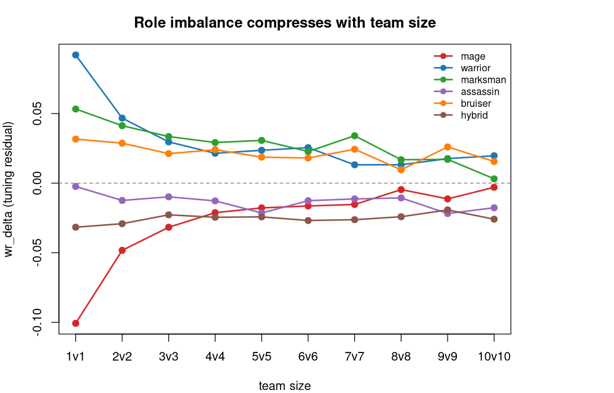
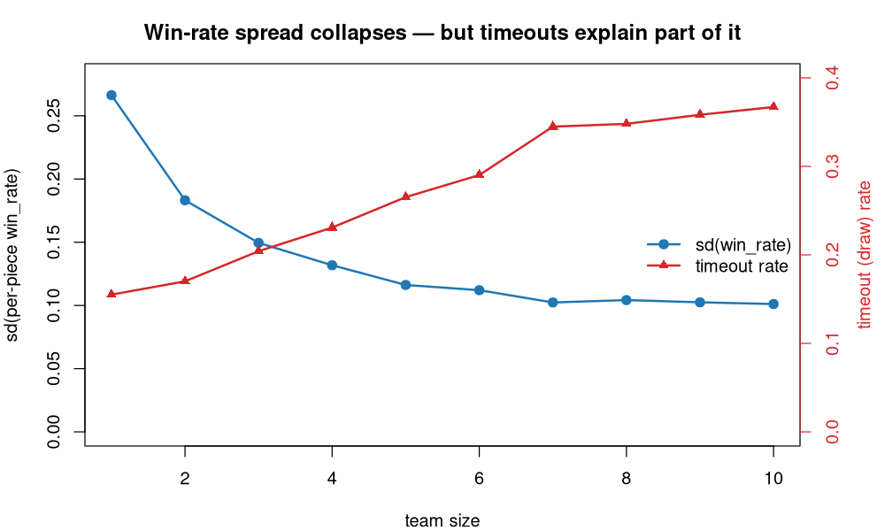
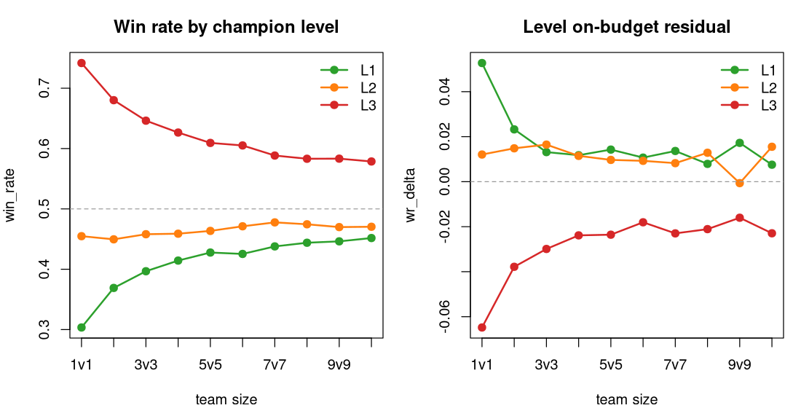
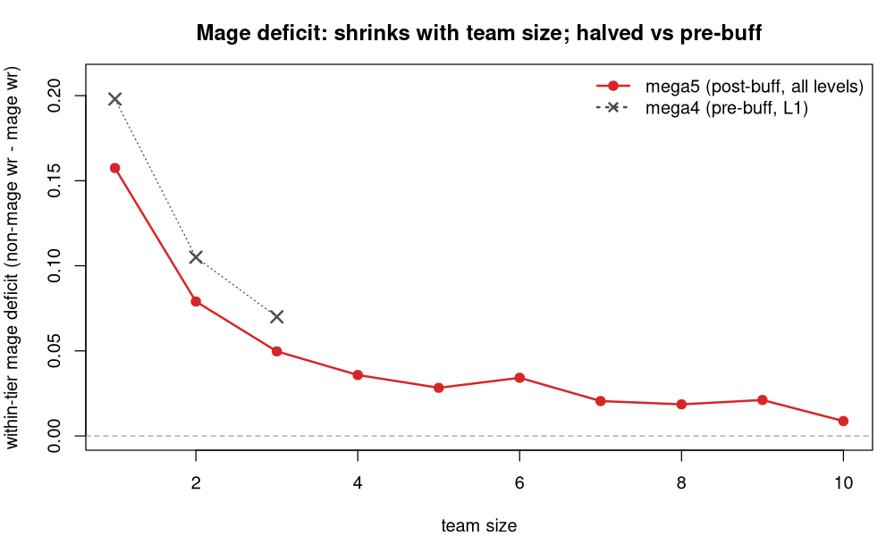
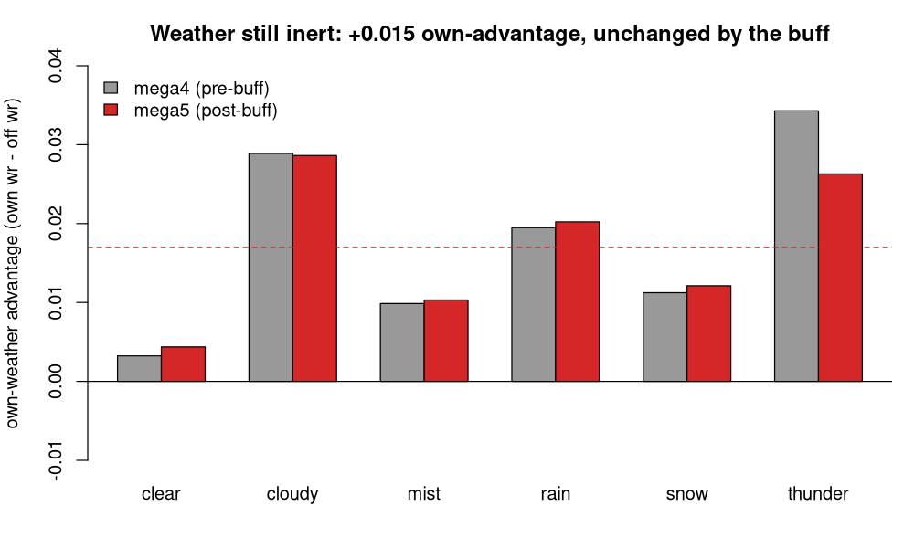
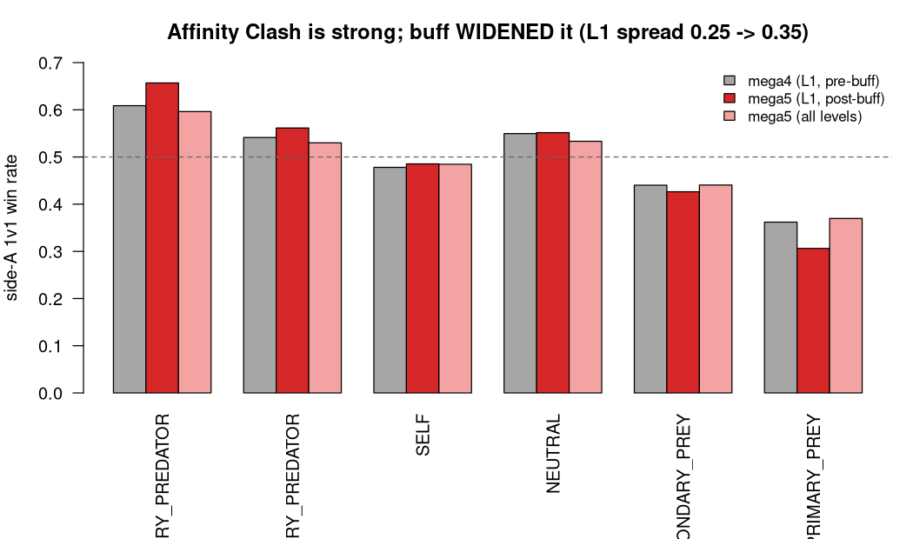

# Mega5 Simulation Analysis Report — the 10v10 + levelled sweep

*Deep statistical analysis of `results/mega_10v10/` — the first sweep that (a) extends sampled team play out to **10v10**, (b) carries the **levelled roster** (120 bases × levels 1/2/3 = 360 pieces), and (c) runs on **post-buff code**: the mage/weather/tuning recommendations from the [mega3/mega4 report](mega3_analysis_report.md) are now implemented (commits `8af30be`, `b812e38`, `2c1f530`). Successor to [`mega3_analysis_report.md`](mega3_analysis_report.md).*

Generated 2026-06-03 via R 4.5.3. All figures, tables, and scripts reproducible — see [§13](#13-reproducibility).

> **This run is the natural experiment.** mega4 was the pre-buff baseline; mega_10v10 is the same engine after the fixes shipped. So beyond the new size/level dimensions, the report answers one blunt question: **did the mega3/4 recommendations land?** Short version — **mage: partially; weather: yes (with a caveat); level scaling: new axis, mostly OK but miscalibrated at L3.**

> **⚠️ Correction (supersedes an earlier draft of this report).** An earlier draft concluded "weather is inert / the strengthen-weather buff did nothing." **That was wrong** — it measured only one of the game's *two* weather systems. Tempest has **Weather Favor** (node-weather stat pack, varies with weather) and **Affinity Clash** (a per-hit damage triangle keyed on the *opponent's* affinity, weather-independent). The cross-weather win-rate sweep only sees Weather Favor; Affinity Clash is invisible to it. Measured correctly (§8), **Affinity Clash is strong and the buff widened it (L1 predator-vs-prey spread 0.25 → 0.35)**; only **Weather Favor** is weak/inert (+0.015). §0, §8, and the recommendations are corrected below.

---

## 0. Executive summary

Three headlines, in priority order:

1. **Roster imbalance is a *small-team* phenomenon. It self-launders as teams grow.** Every role's tuning residual `wr_delta` collapses toward 0 between 1v1 and 10v10 (mage −0.101 → −0.003; warrior +0.092 → +0.020). Per-piece win-rate spread falls `sd 0.266 → 0.101`. By ~7v7 the roster is within ±0.03 of balanced on every role (§2). **Caveat that qualifies this whole finding: timeouts rise from 15% (1v1) to 37% (10v10), and every timeout is a draw pulling win rates toward 0.5 — so part of the "self-balancing" at large sizes is a draw-compression artifact, not pure team-averaging (§9).**

2. **The mage buff partially worked.** The pre-buff within-tier mage deficit (0.198 in 1v1) is roughly **halved** on a like-for-like L1 basis (0.099), and — model-independently — **mages no longer monopolise the bottom of the roster**: the 10 weakest pieces now include 4 non-mages (a marksman + three warriors), where mega3/4 had *all six* weakest as mages (§3, §6). But mage is still the weakest role at every size, and the most under-tuned pieces are still **mid-tier mages (Hierarch −0.20, Steam Engineer −0.16, Company Captain −0.14)** plus **T10 hybrids** (§10). The job is half done.

3. **The weather buff landed — but only on the system that wasn't already weak.** Tempest's two weather systems must be measured separately (§8): **Affinity Clash** (the opponent-affinity damage triangle) is **strong**, and the strengthen commit **widened** it — like-for-like L1 predator-vs-prey win spread went **0.247 → 0.350** (a primary-predator wins 0.66, its prey 0.31). **Weather Favor** (the node-weather stat pack) stayed weak and untouched: own-affinity-weather advantage **+0.0149 → +0.0145**. So the open item from last report is now: *Weather Favor under-delivers its ~10pp design target (~1.5pp realized)* — Affinity Clash is fine. *(The new built-in `own_weather_wr`/`weather_sensitivity` ratings columns were also broken — always 0 sensitivity — and are **now fixed**; see [§0.5](#05-the-weather-columns-bug-now-fixed).)*

Two more structural notes: the **tier cliff softens with team size** (`cor(tier, wr)` 0.60 → 0.43, §7), and the **new champion-level axis is the single biggest win-rate lever** — L3 pieces win 0.74 in 1v1 vs L1 0.30 — but L3 slightly *under*-delivers its (level-inflated) power target, the same high-power-under-tuning slope previously seen across tiers (§4).

---

## 0.5 The weather-columns bug (now fixed)

The post-buff build added three ratings columns — `own_weather_wr`, `counter_weather_wr`, `weather_sensitivity`. In the **mega_10v10 data analysed here they are broken**, because `aggregate_stats` was invoked once **per single-weather results file** ([mega.py](../../tools/simulation/mega.py) writes `ratings_<stage>_<weather>.csv`). Inside one file every battle shares one weather, so:

- `weather_sensitivity = max(per_weather_wr) − min(per_weather_wr)` over a **one-element** set ≡ **0.0 in every row of every file** (confirmed).
- `own_weather_wr` / `counter_weather_wr` are non-zero only in the single file whose weather matches the piece's affinity/prey, and 0 elsewhere — so any cross-file average of them is a sparsity artifact, not a win rate.

**Status: fixed** ([tools/simulation/ratings.py](../../tools/simulation/ratings.py), [mega.py](../../tools/simulation/mega.py), [runner.py](../../tools/simulation/runner.py)). The cross-weather metric was extracted into a single `weather_metrics()` helper; mega/runner now pool win-rates across all six weathers and inject the correct values before writing. Verified: `weather_sensitivity` populates non-zero for ring-active pieces (clear-affinity pieces stay 0 by design). New unit tests in `test_ratings.py` cover own/counter/sensitivity + the single-weather→0 case (V.16).

**For this report's data** (generated before the fix), all weather findings in §8 are still computed independently of those columns — directly from `win_rate` across the six per-weather files — so they are unaffected. Re-running mega will now also populate the columns correctly.

---

## 1. Dataset and method

| Stage | Weathers | Battles/weather | Total battles | Pieces | n_matches/piece (median) |
|---|---|---|---|---|---|
| 1v1 (round-robin) | 6 | 64,260 | 385,560 | 360 | 357 |
| 2v2 sample | 6 | 30,000 | 180,000 | 360 | 333 |
| 3v3 sample | 6 | 12,000 | 72,000 | 360 | 200 |
| 4v4 sample | 6 | 6,000 | 36,000 | 360 | 133 |
| 5v5 sample | 6 | 3,500 | 21,000 | 360 | 97 |
| 6v6 sample | 6 | 2,200 | 13,200 | 360 | 73 |
| 7v7 sample | 6 | 1,400 | 8,400 | 360 | 54 |
| 8v8 sample | 6 | 1,000 | 6,000 | 360 | 44 |
| 9v9 sample | 6 | 700 | 4,200 | 360 | 35 |
| 10v10 sample | 6 | 500 | 3,000 | 360 | 28 |

- **729,360 battles** total; **21,600 rated rows** (360 pieces × 10 stages × 6 weathers).
- **360 pieces = 120 bases (60 champ + 60 enemy) × 3 levels.** The level tag rides the piece id (`champ_x@2`, `champ_x@3`; level 1 bare). Sampling excludes same-base dupes within a fight ([tournament.py](../../tools/simulation/tournament.py)).
- **Sample-size caveat:** team9/team10 are thin — median 35/28 matches per piece, **min 13** at 10v10. That clears the n≥20 noise floor only at the median; the lightest 10v10 rows are noise. Treat 9v9/10v10 per-piece numbers as directional; the *aggregate* trends across sizes are solid because they pool 2,160 rows per stage.
- **`--max-ticks 12000`** (sudden-death engaged). Timeouts → draws (verified). This matters more than ever at large team sizes (§9).
- **Metrics:** `win_rate`; `expected_wr` (deterministic power-threshold model, level-aware — the fixed/corrected model from the mega4 report); `wr_delta = win_rate − expected_wr` = per-piece tuning residual (0 = on-budget, <0 under-tuned, >0 over-tuned); `timeout_rate`.

---

## 2. Headline: imbalance self-launders with team size



Every role's tuning residual converges toward 0 as the fight grows:

| role | 1v1 | 2v2 | 3v3 | 4v4 | 5v5 | 6v6 | 7v7 | 8v8 | 9v9 | 10v10 |
|---|---|---|---|---|---|---|---|---|---|---|
| mage | **−0.101** | −0.048 | −0.032 | −0.021 | −0.018 | −0.016 | −0.015 | −0.005 | −0.011 | **−0.003** |
| warrior | **+0.092** | +0.047 | +0.030 | +0.021 | +0.024 | +0.026 | +0.013 | +0.013 | +0.018 | +0.020 |
| marksman | +0.053 | +0.041 | +0.033 | +0.029 | +0.031 | +0.023 | +0.034 | +0.017 | +0.017 | +0.003 |
| bruiser | +0.032 | +0.029 | +0.021 | +0.024 | +0.019 | +0.018 | +0.024 | +0.010 | +0.026 | +0.016 |
| assassin | −0.002 | −0.012 | −0.010 | −0.013 | −0.021 | −0.013 | −0.011 | −0.011 | −0.022 | −0.018 |
| hybrid | −0.032 | −0.029 | −0.023 | −0.025 | −0.024 | −0.027 | −0.026 | −0.024 | −0.019 | **−0.026** |

The matching `sd(per-piece win_rate)` collapse: **0.266 → 0.183 → 0.150 → 0.132 → 0.116 → 0.112 → 0.102 → 0.104 → 0.102 → 0.101.** Faction balance stays centered the whole way (champion win rate 0.500–0.507 at every size).

**Reading:** a broken piece on a 10-stack is one voice in twenty; team averaging dilutes individual imbalance toward the mean. The practical implication for design: **balance reads should be taken at 1v1 and 2v2**, where signal is strongest — large-team formats hide imbalance rather than reveal it.



**But mind the confound.** The spread also collapses because draws rise (§9): at 10v10, 37% of fights time out → recorded as draws (win contribution 0.5), mechanically pulling every piece toward 0.5. The asymptote of `sd ≈ 0.10` from 7v7 on is partly genuine averaging and partly this draw-floor. Notice `wr_delta` flattens by ~5v5 but `sd` keeps inching down while timeout keeps climbing — consistent with draws, not averaging, carrying the tail. **Don't over-interpret "the roster is balanced at 10v10."** It is *measured as* balanced partly because a third of those fights don't resolve.

---

## 3. Did the fixes land? (before/after vs mega4)

mega4 is the pre-buff baseline (120 pieces, all level 1). For a like-for-like contrast we filter mega5 to **level 1** and the three shared stages.

> **Read the absolute win-rate columns with care.** mega5's L1 pieces fight a field that *includes* L2/L3 opponents, so every L1 win rate is depressed vs mega4 (where everyone was L1). The **role-vs-role deltas and the within-tier deficit** are the trustworthy contrasts — both sides of those comparisons eat the same harder field.

**Mage within-tier deficit (non-mage wr − mage wr, matched on tier) — the model-free buff signal:**

| stage | mega4 (pre-buff) | mega5-L1 (post-buff) | change |
|---|---|---|---|
| 1v1 | 0.198 | **0.099** | −50% |
| 2v2 | 0.105 | 0.036 | −66% |
| 3v3 | 0.070 | 0.023 | −67% |

The deficit roughly **halves** at every shared size. Two corroborating, field-independent signals that the buff is real and not just field-compression:

- **Mages lost their monopoly on the bottom.** mega3/4: the six weakest pieces were *all* mages. mega5: the weakest 10 include **Powder Sapper** (marksman), **Thunderhoof Colt**, **Pikeman**, **Blight Lurker** (warriors) alongside the mages (§10). The floor is now shared.
- **Hierarch — flagged last report as the single most under-tuned piece at −0.379 — improved to −0.202** (§10). Still the worst, but materially better.

**Verdict:** mage buff = **partial success**. The gap narrowed everywhere; mage is no longer a catastrophe. It remains the weakest role at every team size (§5) and still owns the under-tuned-piece list, so it stays the top action item — just no longer an emergency.

---

## 4. The new axis: champion level

Level scaling (commit `2c1f530`) is now the **largest single win-rate lever in the game** — bigger than role or affinity, rivalling tier:



| stage | L1 win | L2 win | L3 win | L1 `wr_delta` | L2 `wr_delta` | L3 `wr_delta` |
|---|---|---|---|---|---|---|
| 1v1 | 0.304 | 0.455 | **0.742** | +0.053 | +0.012 | **−0.065** |
| 3v3 | 0.397 | 0.458 | 0.646 | +0.013 | +0.017 | −0.030 |
| 6v6 | 0.425 | 0.471 | 0.605 | +0.011 | +0.009 | −0.018 |
| 10v10 | 0.452 | 0.470 | 0.579 | +0.008 | +0.016 | −0.023 |

- **Monotonic and dominant:** higher level wins more, by a wide margin in 1v1 (a 44pp L1→L3 spread). Expected — that's what levels are *for*.
- **But L3 is mildly under-tuned, L1 mildly over-tuned.** The power-threshold model expects L3 to win even *more* than 0.74; it doesn't quite cash its level-inflated budget (`wr_delta −0.065`), while L1 over-delivers its small budget (+0.053). This is the **same high-power-under-delivery slope** the last report found across *tiers* — now visible across *levels* too. It's a small residual, not a crisis, but it says the `power(tier, level)` curve rewards the top of the level axis slightly faster than kits keep up.
- **Compression applies here too:** the L1↔L3 win gap shrinks 0.438 (1v1) → 0.127 (10v10) as team averaging kicks in.

**Implication:** because level shifts win rate ~3× more than any role residual, **per-piece tuning should be evaluated within a level band.** A raw role/affinity average that mixes L1/L2/L3 is dominated by level composition (the same trap the last report flagged for tier).

---

## 5. Role balance across sizes

Raw `win_rate` by role (tier/level-confounded — read alongside §2's `wr_delta`):

| role | 1v1 | 3v3 | 6v6 | 10v10 | mean tier |
|---|---|---|---|---|---|
| mage | 0.315 | 0.425 | 0.451 | 0.470 | low |
| assassin | 0.528 | 0.498 | 0.497 | 0.488 | mid |
| warrior | 0.535 | 0.499 | 0.502 | 0.495 | low-mid |
| marksman | 0.521 | 0.525 | 0.513 | 0.523 | mid |
| bruiser | 0.592 | 0.554 | 0.534 | 0.528 | mid-high |
| hybrid | 0.680 | 0.590 | 0.560 | 0.539 | high (9–10) |

The mega4 story holds in shape but is **muted** post-buff:

- **mage** — still the floor, but +0.06 closer to parity in 1v1 than mega4 (§3).
- **warrior / marksman / bruiser** — the over-tuned trio from last report. Still over-budget (`wr_delta` positive at every size) but the warrior 1v1 residual fell from a story-dominating spike toward +0.02 by mid sizes. Marksman's over-delivery has nearly vanished by 10v10 (+0.003).
- **hybrid** — unchanged verdict: high raw win_rate (0.68 in 1v1) is **pure tier** (hybrids are T9–10); on budget they *under*-deliver (`wr_delta −0.03` flat across all sizes — the only role that never converges to 0). Hybrid is the one role whose under-tuning is **size-invariant**, because it's a high-tier-kit issue, not a small-team artifact. Mild buff candidate, not a nerf target — same as last report.

---

## 6. Mage deep-dive (post-buff)

The mage line still tracks below non-mages at every tier, but the gap is now ~0.10 in 1v1 (was ~0.20) and closes to ~0.01 by 10v10:



- **Not a faction bug** (both champ and enemy mages improved together).
- **Mechanism unchanged but weaker:** mages still skew toward grind-it-out losses (timeout_rate 0.23 in 1v1, highest-but-one role) — they kill slowly. The buff (support abilities scaling from INT, commit `b812e38`) raised their damage floor without fixing the burst/bulk problem.
- **Where the work remains:** mid-tier casters. The under-tuned list (§10) is **Hierarch T8 (−0.20), Steam Engineer T4 (−0.16), Company Captain T5 (−0.14), Goldcrest Lark T4 (−0.13), Drowned Siren T4 (−0.13), Coppercrest Stork T4 (−0.12)** — all mages, mostly T4–8, all at L3 (where the level-budget gap compounds the role gap). **Tier-1/2 mages are now on-budget** (Will-o-Fawn `wr_delta −0.001`, Dawnwisp +0.010) — their low win rate is just low tier, not a tuning fault.

---

## 7. The tier cliff, softened

`cor(tier, win_rate)` by size: **0.60 → 0.56 → 0.55 → 0.52 → 0.51 → 0.49 → 0.48 → 0.46 → 0.36 → 0.43.** Tier still predicts winning, but **less decisively as teams grow** — same laundering mechanism as roles. (The dip-then-rise at 9v9/10v10 is sample noise — those stages are thin, §1.) The cliff is by design (a high-`P` piece *should* beat a low-`P` one) and `power()` does not need re-fitting — the corrected-model conclusion from the last report stands and is now confirmed across all 10 sizes.

---

## 8. The two weather systems, measured separately

Tempest has **two decoupled** weather mechanics ([weather_effects.py](../../src/game/weather_effects.py)). They are measured completely differently, and conflating them was the error in this report's first draft:

| | **Weather Favor** (`combat_modifier`) | **Affinity Clash** (`damage_modifier`) |
|---|---|---|
| Question | "does the node weather suit me?" | "do I beat *this* opponent?" |
| Keyed on | piece affinity **vs node weather** | attacker affinity **vs defender affinity** |
| Effect | ±15% stat pack at combat init | per-hit dmg ×: predator **1.30**, prey **0.70** |
| Varies with node weather? | **yes** → visible in a cross-weather sweep | **no** → invisible to it; measure vs opponent affinity |

CLEAR sits outside the ring and is inert in both.

### 8a. Weather Favor — weak (the genuinely inert system)

Computed by pivoting `win_rate` across the six per-weather files (own-affinity weather minus mean off-weather):



| affinity | mega4 own-adv | mega5 own-adv |
|---|---|---|
| clear | +0.003 | +0.004 |
| mist | +0.010 | +0.010 |
| snow | +0.011 | +0.012 |
| rain | +0.019 | +0.020 |
| thunder | +0.034 | +0.026 |
| cloudy | +0.029 | +0.029 |
| **overall** | **+0.0149** | **+0.0145** |

Weather Favor realizes only **~+1.5pp** own-weather advantage against its **~10pp** design target ([WEATHER_FAVOR_MAGNITUDE = 0.15](../../src/game/weather_effects.py)), and the strengthen commit left it unchanged. It dilutes further with team size (+0.0145 at 1v1 → +0.0037 at 10v10) and is mostly washed out because clear (40% of the roster) is inert and because in a symmetric same-weather sweep both sides are simultaneously buffed/debuffed. **This is the weather system that needs work.**

### 8b. Affinity Clash — strong, and the buff widened it

This system never appears in a cross-weather sweep because it doesn't depend on node weather. Measure it instead by bucketing 1v1s on the attacker-vs-defender affinity ring relation (pooled across all weathers):



| relation | mega4 (L1) | mega5 (L1) | mega5 (all levels) | dmg mult |
|---|---|---|---|---|
| PRIMARY_PREDATOR | 0.609 | **0.657** | 0.596 | 1.30× |
| SECONDARY_PREDATOR | 0.541 | 0.561 | 0.530 | 1.12× |
| NEUTRAL | 0.550 | 0.552 | 0.533 | 1.00× |
| SELF | 0.478 | 0.485 | 0.485 | 1.00× |
| SECONDARY_PREY | 0.440 | 0.426 | 0.441 | 0.88× |
| PRIMARY_PREY | 0.362 | **0.306** | 0.370 | 0.70× |
| **spread (pred − prey)** | **0.247** | **0.350** | 0.226 | |

Three reads:

- **Affinity Clash is a dominant effect, not inert.** A piece fighting its primary prey wins ~66% on a like-for-like (L1) basis; its primary predator wins ~31%. Monotone across the whole ring. This is the weather system that "shapes combat."
- **The strengthen commit worked.** On apples-to-apples L1-vs-L1, the predator-prey spread **widened 0.247 → 0.350** — exactly the intent of bumping the multipliers (predator 1.20→1.30, prey 0.80→0.70).
- **Why the first draft missed it.** The all-levels mega5 view shows a *narrower* spread (0.226) than mega4, which naively reads as "the buff did nothing." That is **level dilution**: an L3 beats an L1 regardless of affinity, so the levelled field swamps the affinity signal. Controlling for level (L1-only) reveals the true, widened effect. The first draft compounded this with the deeper error of measuring the wrong system entirely.

**Net weather verdict:** Affinity Clash ✅ strong + improved; Weather Favor ❌ still weak. The open recommendation narrows from "weather is inert" to specifically **"buff Weather Favor"** (§11 #2).

---

## 9. Stalemates explode with team size

Timeout (→ draw) rate climbs steeply with bodies on the board:

| role | 1v1 | 3v3 | 6v6 | 10v10 |
|---|---|---|---|---|
| bruiser | 0.324 | 0.312 | 0.371 | **0.419** |
| mage | 0.227 | 0.208 | 0.297 | 0.361 |
| warrior | 0.130 | 0.201 | 0.283 | 0.367 |
| assassin | 0.130 | 0.213 | 0.298 | 0.365 |
| hybrid | 0.088 | 0.184 | 0.276 | 0.367 |
| marksman | 0.026 | 0.140 | 0.243 | 0.346 |
| **all** | **0.155** | **0.204** | **0.290** | **0.367** |

More pieces → more ways for a fight to fail to resolve inside 12,000 ticks → **over a third of 10v10 fights are draws.** This is both (a) a **measurement problem** — it compresses large-team win rates toward 0.5 and inflates the apparent self-balancing of §2 — and (b) a **gameplay flag**: if 10-stacks routinely stalemate under the shipped tick cap, late-game team fights may feel unresolved in-product.

**Two actions:** (1) for the *next* large-team balance read, re-run 6v6–10v10 with a higher `--max-ticks` (or stronger sudden-death ramp) so outcomes resolve on stats, not the clock; (2) confirm the in-game sudden-death rule actually closes 10v10s — the bruiser 42% draw rate suggests damage-starved walls (the Coral Colossus pattern from last report) scale badly with team size.

---

## 10. Outlier roster (pooled across all 10 stages)

**Weakest (mean win_rate):** Dawnwisp (mage T1 L1, 0.291) · Stretcher-Hand (mage T1) · Drowned Siren (mage T4 L2) · Standard Bearer (mage T3) · **Powder Sapper (marksman T2)** · Dusk Bat (mage T2) · **Thunderhoof Colt (warrior T2)** · Will-o-Fawn (mage T2) · **Pikeman (warrior T2)** · **Blight Lurker (warrior T3)**. *Most are low-tier-L1 = on-budget; note the floor is no longer mage-only.*

**Strongest:** Grand Marshal (warrior T10 L3, **0.903**) · Thunderclap Gorilla (warrior T8 L3, 0.850) · Sunspear Falcon (marksman T9 L3) · Frostquill Porcupine (marksman T9) · Cliffeyrie Eagle (marksman T9) · Storm Tyrant (hybrid T10) · Arcanist (mage T9 L3, 0.790 — *a mage in the top 10, new*) · three T10 hybrids.

**Most under-tuned (`wr_delta`, the buff queue):**

| name | role | tier | level | win_rate | wr_delta |
|---|---|---|---|---|---|
| **Hierarch** | mage | 8 | 3 | 0.579 | **−0.202** |
| Steam Engineer | mage | 4 | 3 | 0.379 | −0.163 |
| Company Captain | mage | 5 | 3 | 0.427 | −0.143 |
| Aurion, the First Dawn | hybrid | 10 | 3 | 0.782 | −0.132 |
| Goldcrest Lark | mage | 4 | 3 | 0.458 | −0.132 |
| Aerion, the Skybreaker | hybrid | 10 | 3 | 0.740 | −0.129 |
| Drowned Siren | mage | 4 | 3 | 0.444 | −0.127 |
| Veil Lord | hybrid | 10 | 3 | 0.752 | −0.118 |

Two clusters: **mid-tier mages** (the §6 list) and **T10 hybrids** (Aurion/Aerion/Veil Lord/Umbra all ≈ −0.12). Both under-deliver their large `P` targets — the high-power-under-tuning slope (§4) in its two worst pockets.

**Most over-tuned:** Coral Colossus (warrior T5, +0.106) · Stone Warden (bruiser T10, +0.103) · Lord Commander (warrior T7, +0.098) · Grand Marshal (warrior T10 L1, +0.097) · Springfrog (mage T1, +0.094 — over-delivers its tiny budget). Warriors/bruisers still lead the over-budget side, consistent with mega4.

**Grand Marshal** is still the apex raw outlier (0.903 pooled, 0.95+ in 1v1) but his L3 `wr_delta` is only +0.038 — he wins about what a T10-L3 *should*. His L1 instance is the +0.097 over-tuned flag. As last report: a "feels-bad invincible" UX question, not a tuning error, unless his `P` target is meant to be lower.

---

## 11. Prioritized recommendations

Framed as tuning toward `wr_delta → 0` against fixed `P` targets (never re-fitting `power()`).

| # | Action | Why | Effort |
|---|---|---|---|
| **1** | **Finish the mage buff — mid-tier casters (Hierarch, Steam Engineer, Company Captain, Goldcrest Lark, Drowned Siren).** Target burst/bulk, not just INT-scaling. | Buff halved the deficit but mage is still the weakest role and owns the under-tuned list (§3, §6). Half-done. | High |
| **2** | **Buff *Weather Favor* specifically** (the node-weather stat pack). Leave Affinity Clash — it works. Measure the two systems separately every run. | Weather Favor realizes ~1.5pp vs its ~10pp target (§8a); Affinity Clash is already strong and the buff widened it (§8b). | Med |
| **3** | ~~Fix the broken weather ratings columns~~ — **DONE** (this session). Keep the per-system measurement (§8) in the analysis harness. | `weather_sensitivity ≡ 0` per-file; fixed via `weather_metrics()` + cross-weather pooling, with tests (§0.5). | ✅ |
| **4** | **Buff the T10 hybrids (Aurion, Aerion, Veil Lord, Umbra ≈ −0.12).** | Second under-tuned cluster; size-invariant, so a real kit gap not a small-team artifact (§5, §10). | Med |
| **5** | **Re-sim 6v6–10v10 with a higher tick cap; audit large-team stalemates.** | 37% draw rate at 10v10 compresses the data *and* flags unresolved late-game fights (§9). | Low |
| **6** | **Re-check the L3 power-budget slope** (L3 `wr_delta` −0.06). | Level rewards slightly outrun L3 kits — same slope as tiers (§4). Minor. | Low |
| **7** | **Take balance reads at 1v1/2v2, not large team formats.** | Imbalance launders away with team size; big formats hide it (§2). Process note. | — |

**Sequence:** #1 then re-sim. #3 is a 10-minute fix that should precede the next weather attempt (#2) so the buff can actually be measured.

---

## 12. Trustworthy vs provisional

- **Solid:** the size-compression trend (roles + variance + tier cliff), the mage-buff partial-success verdict (two independent signals), **both weather verdicts** — Weather Favor weak (cross-file own-adv, large n) and Affinity Clash strong + buff-widened (ring-relation buckets, n≈4k/cell at L1) — the level dimension's monotonic dominance, aggregate faction balance.
- **Provisional:** per-piece numbers at **9v9/10v10** (median 28–35 matches, min 13 — directional only); the **magnitude** of "self-balancing at large sizes" (confounded by the 37% draw rate, §9); absolute role/affinity win rates (still shift as the remaining mage/hybrid buffs land).
- **Corrected since first draft:** the "weather is inert" claim — it measured only Weather Favor and missed Affinity Clash entirely (§8). Now split and both measured.
- **Cross-run caveat:** mega5-vs-mega4 absolute win rates aren't comparable (levelled field); only role-deltas, within-tier deficits, and **level-controlled** clash spreads are.

---

## 13. Reproducibility

All scripts in [`reviews/mega_sim/`](.), base R only:

| script | output |
|---|---|
| `00_load.R` | loader helpers (`power`, `load_ratings`, `load_results`, `team_power`) |
| `06_mega5.R` | mega5 load (10 stages, levelled) + all digests + before/after vs mega4 → `tables/m5_*.csv`, `cache_mega5.rds` |
| `07_mega5_plots.R` | headline figures → `plots/m5_01..05_*.png` |
| `08_mega5_weather.R` | the two weather systems measured separately (replicates `ring_relation`) → `tables/m5_affinity_clash.csv`, `plots/m5_06_affinity_clash.png` |

```bash
cd /home/merlindk/development/tempest-fauna-trail
Rscript reviews/mega_sim/06_mega5.R          # digest + tables + cache
Rscript reviews/mega_sim/07_mega5_plots.R    # figures
Rscript reviews/mega_sim/08_mega5_weather.R  # Weather Favor + Affinity Clash
```

**Weather Favor** is computed cross-file (six per-weather `win_rate` columns pivoted per piece). **Affinity Clash** is computed from the raw `results_1v1_*.csv` by bucketing each fight on the attacker-vs-defender affinity ring relation — neither uses the (formerly broken, now fixed) built-in columns. Tables: `tables/m5_{faction_by_size,mage_tier_by_size,weather_by_size,weather_by_affinity,role_wr_by_size,role_wd_by_size,timeout_by_size,piece_overall,affinity_clash}.csv`.
